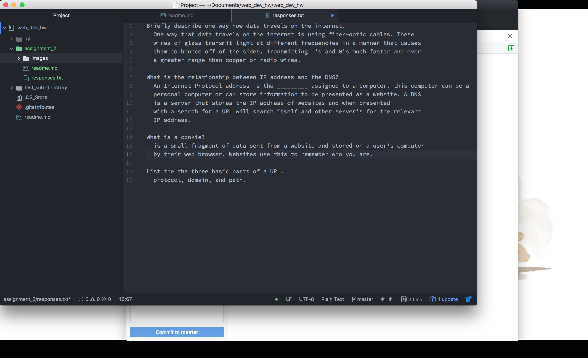

# Assignment 2
##

  A version control system allows a developer or group of developers to track their progress over the life of the project.By using this system, we can test changes to our code without fear of making uneditable mistakes or deleting code we may actually need later on by allowing for the developer to return to that version later. Version control also allows colaboration and ease of communication in groups. By having a system for detailing changes to code and a location to for all members ot access that code, the team can understand what is going on with their project without having to work in the same room or at the same time. As students, we are still learning, having a system to look back at previous iterations of our work and recognise mistakes in either the new or older versions that might be fixable by combining both wil lgreatly help in our learning.
---
### Responses
  My [responses](./responses.txt) file link.
---
### This Cycle's Work Summery:
  (Summarize the work you did this cycle, paying particular attention
  to the individual choices you made.)

Did you have any problems or issues? How did you solve these?

  I had no issues, switching between sites can be a bit confusing when looking for assignment details though. It's just something to get used to.

Is there anything in particular you learned that you would like to discuss further?

  Nothing in particular. One of the videos mentioned some new ways to expand the internet that interest me though.

Did you post any of your problems to issues to the repo? What issues did you help your fellow classmates out with this past homework cycle?

  I did not. I had no issues and by the time i looked at other's issues, they were solved.
---
### Screenshot:

