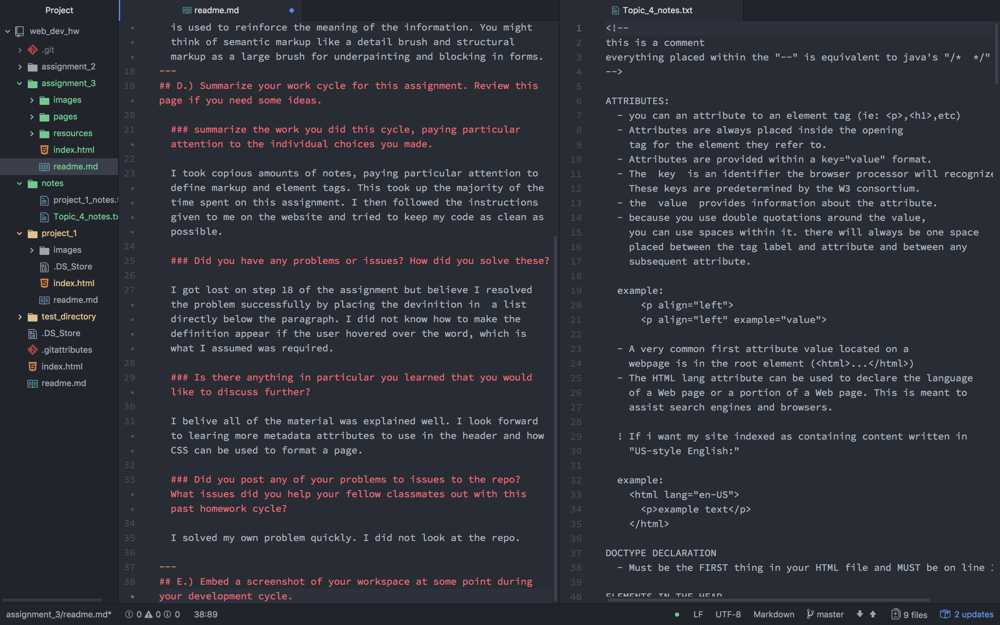

# Assignment 3 ReadMe

## A.) One line 1, using a heading 1 or 2, title your readme.md.
---
## B.) How many "head" and "body" elements can a page have? How are these elements different, or what role do they play?

  You can have one of each per page. The difference between the two is that the head holds information not directly rlevant or viewable by the user. Meta-data such as the title of the page or the character set used are held here. The body is where the presenting of information takes place. Limited directions for how the browser is to display information is given here.

---
## C.) Describe the difference between structural and semantic markup.

  Structural markup helps to guide the user visually and provides instructions on the structure of the document. Semantic markup is used to reinforce the meaning of the information. You might think of semantic markup like a detail brush and structural markup as a large brush for underpainting and blocking in forms.
  
---
## D.) Summarize your work cycle for this assignment. Review this page if you need some ideas.

  ### summarize the work you did this cycle, paying particular attention to the individual choices you made.

  I took copious amounts of notes, paying particular attention to define markup and element tags. This took up the majority of the time spent on this assignment. I then followed the instructions given to me on the website and tried to keep my code as clean as possible.

  ### Did you have any problems or issues? How did you solve these?

  I got lost on step 18 of the assignment but believe I resolved the problem successfully by placing the devinition in  a list directly below the paragraph. I did not know how to make the definition appear if the user hovered over the word, which is what I assumed was required.

  ### Is there anything in particular you learned that you would like to discuss further?

  I belive all of the material was explained well. I look forward to learing more metadata attributes to use in the header and how CSS can be used to format a page.

  ### Did you post any of your problems to issues to the repo? What issues did you help your fellow classmates out with this past homework cycle?

  I solved my own problem quickly. I did not look at the repo.

---
## E.) Embed a screenshot of your workspace at some point during your development cycle.

