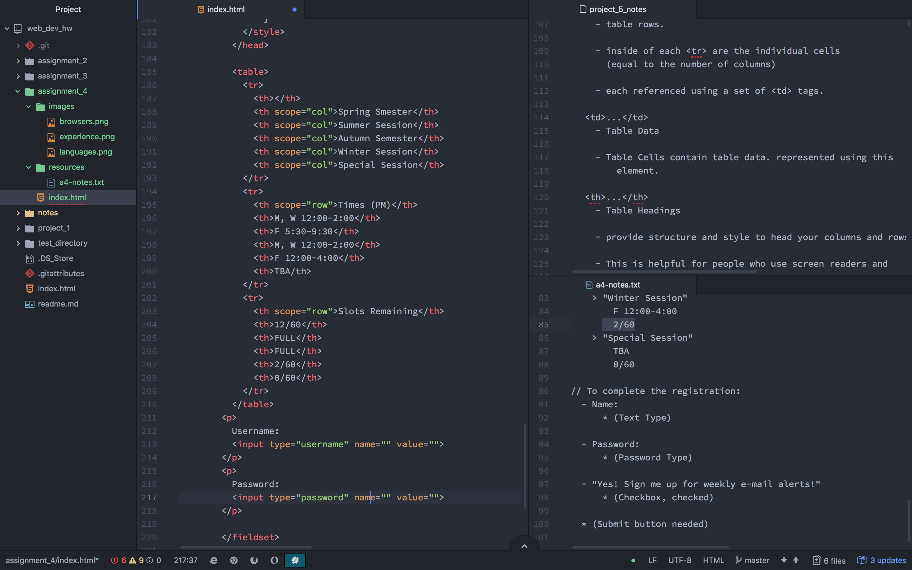

#William Wohlman Readme

What is "alt text," and why do we use it?

  Alt text allows webpage readers to explain images vocally by providing a description.

Describe any forms you've come across while browsing the web. What purposes do the serve?

  Artwork submission forms. Sites like DA or Artstation use file uploads, textboxes for descriptions, titles, and checkboxes for types of work.

Summarize your work cycle for this assignment.

  Same as the last ones, I took notes going through the Module. Then worked through the assignment step by step.

Embed a screenshot of your workspace at some point during your development cycle.

  
