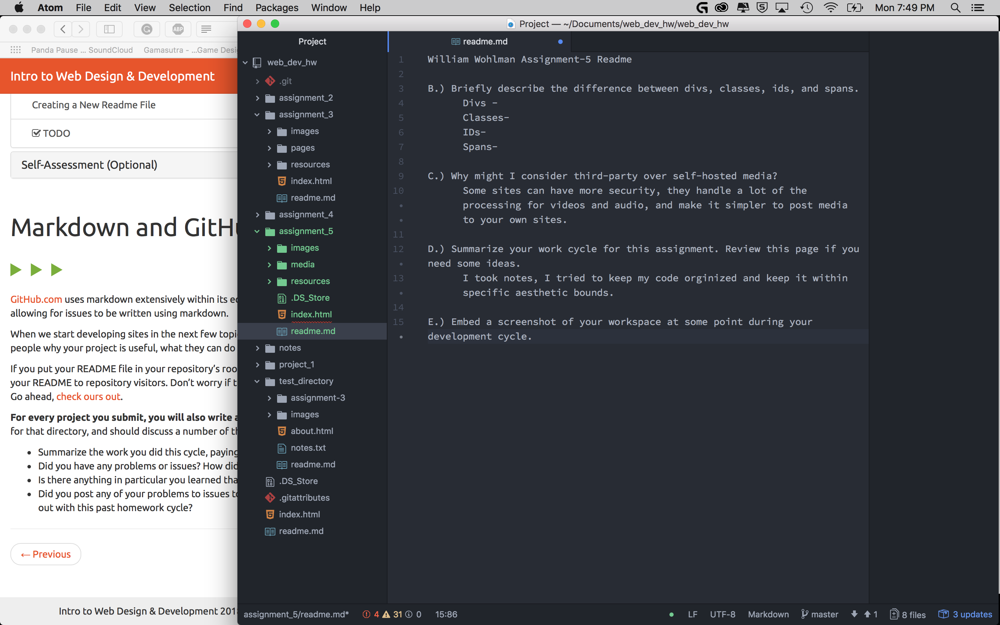

William Wohlman Assignment-5 Readme

B.) Briefly describe the difference between divs, classes, ids, and spans.
      Divs- used to devide up the page and establish specific aesthetic  terms for specific types of Divs.
      Classes- an attribute of divs used to define types of Divs and catagorize them.
      IDs- another attribute of divs to identify an element as an individual.
      Spans- sets a type of style for things like text.

C.) Why might I consider third-party over self-hosted media?
      Some sites can have more security, they handle a lot of the processing for videos and audio, and make it simpler to post media to your own sites.

D.) Summarize your work cycle for this assignment. Review this page if you need some ideas.
      I took notes, I tried to keep my code orginized and keep it within specific aesthetic bounds.

E.) Embed a screenshot of your workspace at some point during your development cycle.

  
