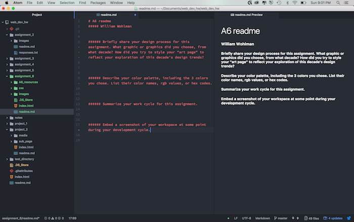

# A6 readme
##### William Wohlman
---

###### Briefly share your design process for this assignment. What graphic or graphics did you choose, from what decade? How did you try to style your "art page" to reflect your exploration of this decade's design trends?

I used the 1980s-08.png and 1980s-05.png.

While I was soon removed from the idea, I origionally intended for the piece to look like this:

I tried to consider the use of large swafts of color and overlaying of simple shapes while using a contemporary understandign of compositional trends. I kept my font rounded with a drop shadow. As many of the forms during design of this time were simple and clean.

***
###### Describe your color palette, including the 3 colors you chose. List their color names, rgb values, or hex codes.

It is difficult to decide on a color pallet when every primary color is used. I started with using seven of the resource images. Realising I was doing more work than was really nessisary, I brought my ambition back a bit and decided on using two icons with similar pallets and working from there. that is where the blue and green came from. The white came about because I needed something to place on the backgound.

+ color 1 - #3fb58e - mint green
+ color 2 - #5a86d1 - light azure blue (desaturate and add white to azure blue and this is what you get)
+ color 3 - #e8e8e8 - blue off-white tint
***
###### Summarize your work cycle for this assignment.

Onece I decided on one of the eras, I created a mockup in photoshop using seven of the resources. Realising this was ambitios, I decided to avoid that. I wanted to layer two of the dotts over eachother but found that I had a white background on them when I did. Therby blocking the other image below it. I didnt find a solution for this until the end of the project and did not pursue this. I still cannot figure out how to remove the same background from my text. so it stayed.

###### Embed a screenshot of your workspace at some point during your development cycle.

