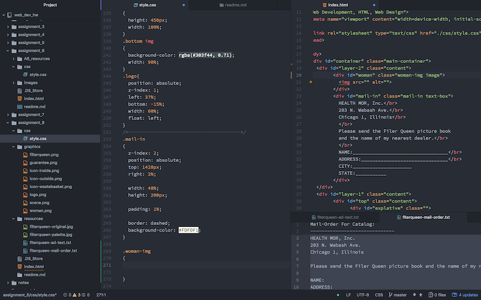

# A8 readme
##### Wohlman Box Model

##### What is the difference between padding, margin, and borders?

pading can be thought to be inside of the box you're affecting. Moving the internal items.

Margins are on the outside. Increasing the size of the box while increasing the distance from other objects.

Borders are the division between the box and what is outside of it. The border, when increased, also increases the size of the box.

##### What was the hardest task for you to accomplish this assignment? For example, was it overlapping elements, working with muliple fonts, creating layout, or something else entriely?

Specifically getting the logo to sit correctly in the space. I had to adjust the z-level manually rather than in the 
 class it was inside of. Which was a bit upsetting.

##### Summarize your work cycle for this assignment. Review this page if you need some ideas.

Standard work cycle. Went through the reading material then the assignment.

##### Embed a screenshot of your workspace at some point during your development cycle.

