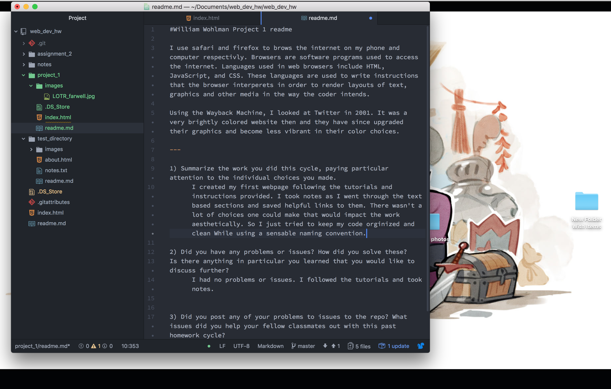

# William Wohlman Project 1 Readme

I use safari and firefox to brows the internet on my phone and computer respectivly. Browsers are software programs used to access the internet. Languages used in web browsers include HTML, JavaScript, and CSS. These languages are used to write instructions that the browser interprets in order to render layouts of text, graphics and other media in the way the coder intends.

Using the Wayback Machine, I looked at Twitter in 2001. It was a very brightly colored website then and they have since upgraded their graphics and become less vibrant in their color choices. These changes make it more appealing to the eye.

---

1) Summarize the work you did this cycle, paying particular attention to the individual choices you made.

  I created my first webpage following the tutorials and instructions provided. I took [notes](web_dev_hw/notes/project_1_notes.txt) as I went through the text based sections and saved helpful links to them. There wasn't a lot of choices one could make that would impact the work aesthetically. So I just tried to keep my code orginized and clean While using a sensable naming convention.

2) Did you have any problems or issues? How did you solve these?
Is there anything in particular you learned that you would like to discuss further?

  I had no problems or issues. I followed the tutorials and took [notes](web_dev_hw/notes/project_1_notes.txt).

3) Did you post any of your problems to issues to the repo? What issues did you help your fellow classmates out with this past homework cycle?

  See question 2. I did not visit the help boards. Although, with the frequent emails, I should start responding when someone posts something.

---

You may be able to tell that I did not read the assignment until after I was done with the tutorials and left this part for last.

