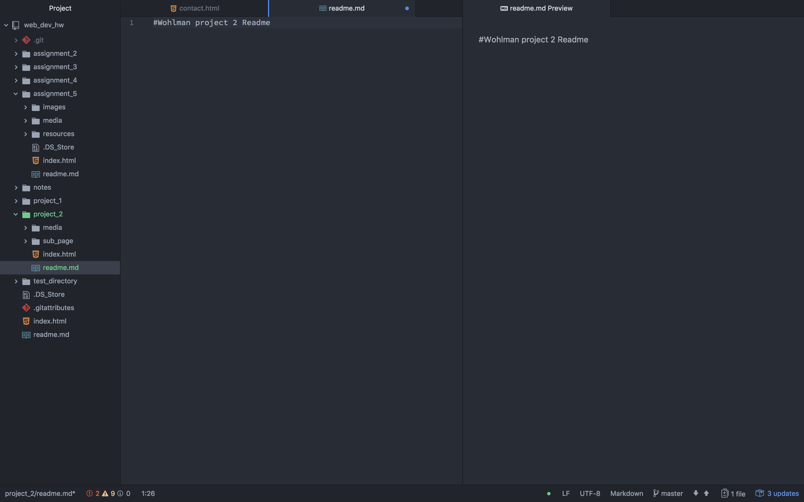

## Wohlman project 2 Readme

#### B.) Briefly recap your experience learning HTML. What was old, new, interesting, or difficult to learn?

  I have found html to be very flexible in a way that is really quite forgiving. I am fre to test what the program allows me to do because many of the wordage for specific actions is mimiced/repeaded/echoed in other places. and it makes sense.

  My experience with java allowed for some more personilization when you got into it (creating your own classes an methods for instance), but was very rigid in how you were to code actions. Not so in HTML. I can put my style section of this label before i't been identified or assigned a class and not have the computer automatically fail me for it. It's definetly not incouraged, but it's an option.

  The ability in HTML to predetermine the format of items before reaching the body is very useful to me. I like my code to have a semblance of neatness and having lines that run off the page nags me henever I see it. So the more information I can stack vertically and in an orginized manner the better.

#### C.) Next Topic we begin CSS and expand on styling, which helps us "decorate" HTML. Is there anything you're anxious or excited to learn about in this new section?
  Im excited to learn some more advanced stylings. I have been looking at a few art gallery websites as reference when working on this project and I really want to know how to do what they do. The possible application (of what I assume is Javascript) for interesting gallery designs and image previews also has me excited.

#### D.) Summarize your work cycle for this assignment. Review this page if you need some ideas.
  I worked a bit like a madman and took on too much. I wrote much more, I feel, than was really nessisary. Played with some interesting concepts and techniques that were not nessisary for the assignment. And have my senior thesis exhibition in less than two weeks. So I should've taken a step back in the initial drafting of the project to look at the amount of work and time I would have to spend on it.

  I got it done, though. It was a lot of copy/pasting and ensuring styles were right.

#### E.) Embed a screenshot of your workspace at some point during your development cycle.
  
